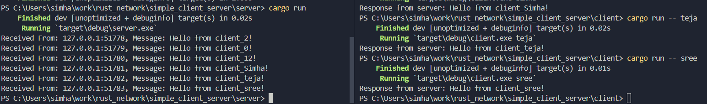

# [Rust] Simple Echo ClientServer project
----

This is a simple practice of simple TCP IP client - server echo application. 
The client starts up and sends a message to server and server sends it back. 

The code is documented. It is MUCH sweeter than the inet mallarky of writing  
socket programs in C/Linux. 

Feel free to use it as you wish (at your risk). I'm not maintaing it. I just 
needed an example of a client server. 

